# NFT Marketplace Fusion Token with NodeJs

## Function เเละ เป้าหมายของ  Project

- สร้างตลาดสำหรับซื้อขาย NFT
- สามารถสร้าง NFT ขึ้นมาได้
- อัพโหลดข้อมูลของ NFT ไปที่ IPFS ( protocol and peer-to-peer network for storing data ) เเละ ข้อมูลบน blockchain
- fusion token ระหว่างสอง token

## Init Project

```
npm install -g truffle
```

เมื่อลงเสร็จเเล้วสามารถเช็ดได้ว่าเราได้ทำการ install สำเร็จหรือไม่ ผ่านคำสั่ง

```
truffle -v
```

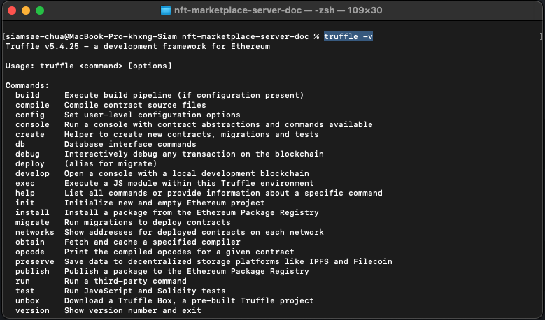

หากทำการ install สำเร็จผลลัพท์จะออกจามรูป

หลังจากนั้นสร้าง folder ปล่าวขึ้นมาสำหรับทำโปรเจค

```
mkdir nft-marketplace-server-doc
```

จากนั้นเข้าไปที่ folder ที่สร้างขึ้นมา

```
cd nft-marketplace-server-doc
```

เเล้วทำการ init project ขึ้นมาผ่าน npm

```
npm init -y
```

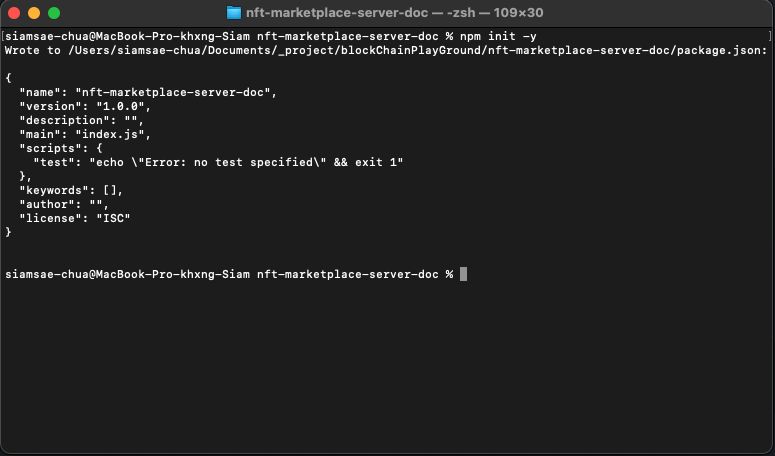

สร้าง folder src เพื่อเก็บไฟล์ต่างๆของ Project

```
mkdir src

cd src

mkdir page & mkdir js
```

จากนั้นจะได้โครงสร้าง floder ตามรูปภาพ

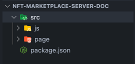

หลังจากสร้างเสร็จเเล้วให้กลับไปที่ root ของ project

```
cd ..

truffle init
```

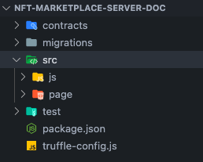

หลังจาก run คำสั่งเเล้วตัว truffle จะทำการสร้าง folder ให้ 3 folder

- folder contracts ใช้สำหรับเขียนไฟล์ solidity

- folder migrations ใช้สำหรับเขียน script เพื่อ deploy ขึ้น blockchain

- folder test ใช้สำหรับเขียน test สำหรับ smart contract

\*\*\*สำคัญมาก ตัว smart contract deploy ไปเเล้วไม่สามารถเเก้ไข้ได้ ทำได้เเค่การ deploy contract อันใหม่ขึ้นไปเเทนเท่านั้น

## Install Dependencies ที่ต้องใช้ใน Project

```
npm install @openzeppelin/contracts chai chai-as-promised express
```

- @openzeppelin/contracts ใช้สำหรับคุณสมบัติของ class ที่เขียนตามมาตรฐาน ERC20 เเละ ERC721 ที่ทาง openzeppelin ได้เขียนไว้มาใช้
- chai เเละ chai-as-promised ใช้สำหรับเขียน test ของ smart contract
- express ใช้สำหรับสร้าง server

## สร้าง File Smart Contract (.sol)

สร้าง file smart contract (.sol) 5 ไฟล์ ใน folder contract

NFT.sol ใช้สำหรับ เขียน contract สำหรับ NFT

NFTMarket.sol ใช้สำหรับ เขียน contract สำหรับ ซื้อขาย nft ที่ถูกสร้างขึ้น

NFTFusion.sol ใช้สำหรับเป็นตัวกลางในการจัดการ NFT และ marketplace ในการ fusion ระหว่างสอง token

INFT.sol เป็น infterface สำหรับเรียกใช้งานคำสั่งจากอีก contract ผ่าน interface

Owner.sol เป็น contract สำหรับบอกว่าใครเป็นเจ้าของ contract และใครบ้านที่สามารถเรียกใช้งาน function ของ owner หรือว่า approvals ได้

## Flow Chart การทำงานของ Application

แต่ละสีแทนการเรียกใช้งาน contract ในแต่ละครั้ง ซึ้งการที่เรานั้นใช้งานได้หลาย contract ในการ call function หนึ่งครั้ง เป็นเพราะเราสามารถเรียกใช้งาน function ของอีก contract ได้ภายใน contract หลักที่เราได้ทำการเรียกใช้าน

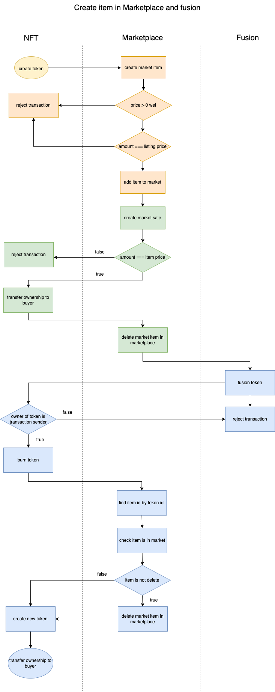

## NFT.sol

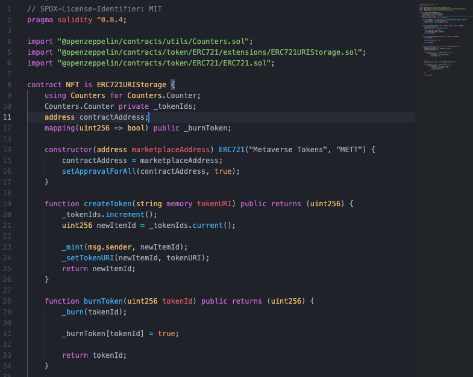

Counter เป็น object ที่ใช้ในการเพิ่มลบจำนวนของ id มี function ย่อย 3 function ได้เเก้ increment() current() decrement() ซึ้งเราจะนำมาใช้เป็น type ของ ตัวแปล \_tokenIds เพื่อใช้ track id ของ token

\_burnToken เป็น mapping ที่เก็บค่า uint256 กับ bool เพื่อใช้ track ว่า token ไหนที่เราได้ทำการ burn ไปแล้ว

โดย constructor ของ contract นี้จะรับ address ของ marketplaceAddress เป็น parameter ซึ้งเราจะใช้ address นี้ในการใช้งาน setApprovalForAll เพื่อให้ contract marketplace สามารถเรียกใช้งาน function ของ contract NFT ที่จำเป็นต้องอยู่ในรายการที่ผ่านการ approve แล้วเท่านั้น

function createToken สำหรับการสร้าง token ขึ้นมาใหม่โดยใช้ \_tokenIds ที่เราสร้างไว้มาเป็น tokenId ตัวใหม่ โดย map กับ tokenURI ที่เราได้ทำการส่งมาด้วย

function burn token เป็นการลบ token ออกจาก mapping ที่ contract ได้ทำการเก็บไว้ ทำให้เราไม่สามารถเข้าถึง owner และ tokenURI ที่เราได้ทำการเก็บไว้ใน mapping ได้อีก


function fetchMyNFTs ทำหน้าที่ในการ filter token ที่เราได้เป็นเข้าของ และ ไม่ได้ทำการ burn ไปแล้วออกมาใรูปแบบของ array (เหตุผลที่เราจำเป็นต้องใช้ตัวแปล totalItemCount ในการ loop เพราะว่าในภาษา solidity นั้น array ไม่มี property length เพื่อหาขนาดของ array ที่เราต้องการจะสร้างและกำหนดค่าให้ array นั้น )

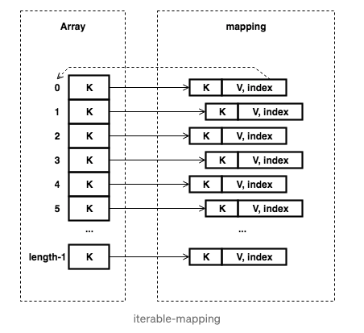

## NFTMarket.sol

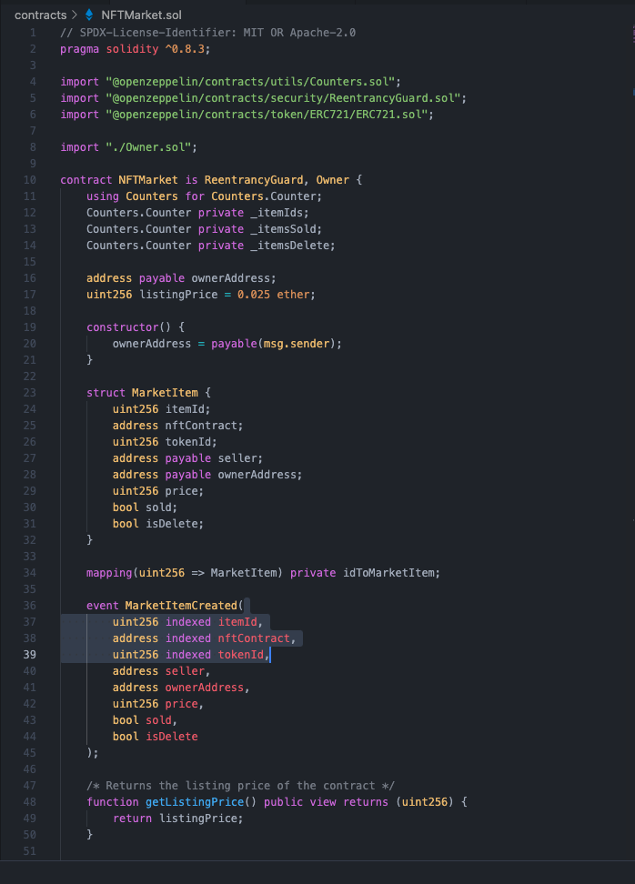

NFTMarket เป็น contract ที่ใช้สำหรับเป็นตัวแทนสำหรับซื้อขาย NFT ที่เราได้ทำการ mint ขึ้นมา

ใน function constructor นั้นเราจะกำหนดให้ผู้ที่สร้าง transaction เป็นเจ้าของของ contract นี้ทำให้ address นั้นสามารถเรียกใช้ function ที่จำกัดให้เฉพาะ owner ได้

struck MarketItem จะเป็น type ที่เราสามารถกำหนดขึ้นเองได้ว่าภายในได้ว่าเราต้องการจะให้มีอะไรบ้างภายใน struct (คล้ายๆ Object)

event MarketItemCreated ให้เราลองนึกภาพคล้ายการเก็บข้อมูลแบบ log แบบปกติที่เราสามารถดักจับ event เมื่อเกิดขึ้นได้ และสามารถ query ขึ้นมาดูได้ส่วน key words indexed นั้นเราใส่เพื่อให้สามารถ query โดยใช้ค่าของตัวแปลนั้นในการ query ได้ โดยเราจะทำการ emit event นี้ทุกครั้งที่มีการ สร้าง market item ขึ้นมาใหม่

idToMarketItem เป็น maping ของ uint256 กับ MarketItem ที่ใช้ map id ของ item เข้ากับข้อมูลของ item นั้นๆ

function getListingPrice ทำหน้าที่ return ค่าธรรมเนียมที่ user ต้องจ่ายทุกครั้งที่ได้ทำการขายสินค้าบน market

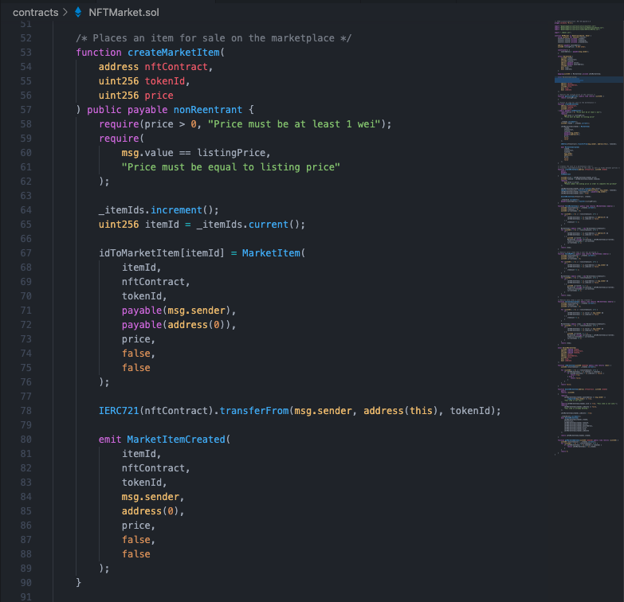

function createMarketItem ใช้สำหรับสร้าง market item ขึ้นมาใหม่โดนการโอนความเป็นเจ้าของของ nft นั้นๆไปที่ contract เพื่อให้ contract market สามารถ list บน market ได้โดย id ของ item นั้นมากจาก \_itemIds และจะถูกเพิ่มค่าขึ้นที่ละ 1 ก่อนการสร้าง item ขึ้นมาในทุกๆครั้ง

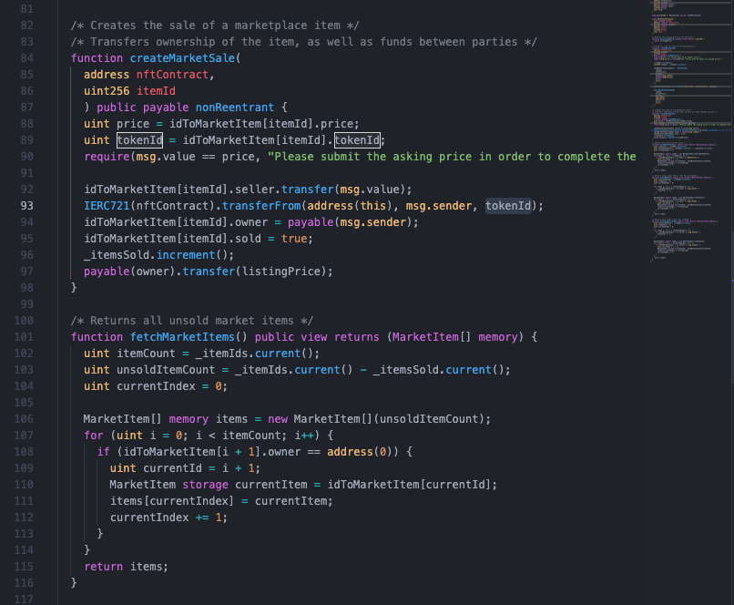

function createMarketSale เป็น function ที่ใช้ซื้อ item ที่อยู่ใน market โดยการโอนเงินตามจำนวนมี่ตั้งให้กับผู้ตั้งขาย แล้วทำการโอนความเป็นเจ้าของของ NFT นั้นให้กับผู้ซื้อ หลังจากนั้นลบ item ที่อยู่บน market

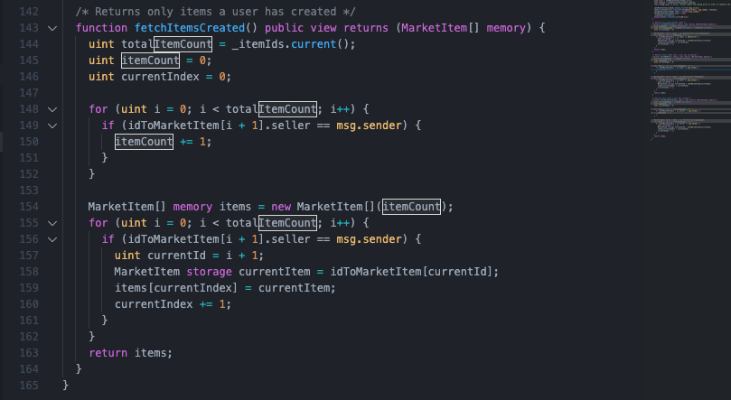

function fetchMyNFTs ทำหน้าที่ return item ที่เราเป็นเจ้าของกลับออกมาในรูปแบบ array เหตุผลที่เราใช้ key words memory เพราะว่าถ้าเราไม่ใช้ node ของ block เวลาที่เขียนกลับส่งมาหาเราจะเขียนบน storage ทำให้ใช้ค่า gas มากว่า การเขียนบน memory และการที่เรากำหนดความยาวของ array ให้กับตัวแปล items จะทำให้ค่า gas ถูกลงกว่าการที่เราไม่กำหนดความยากให้กับ array ในตอนแรก

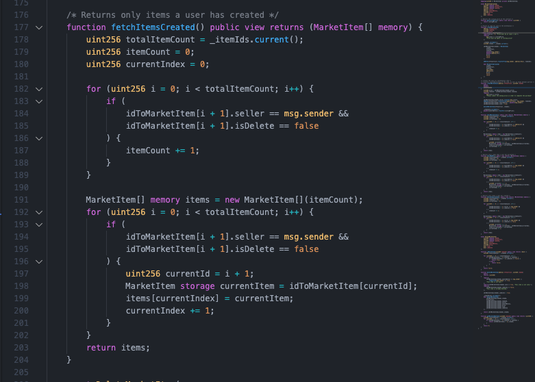

function fetchItemsCreated จะทำหน้าที่เหมือนกับ function fetchMyNFTs แต่จะเปลี่ยนเงื่อนไขเป็น item ที่เราเป็นคนสร้างแทน

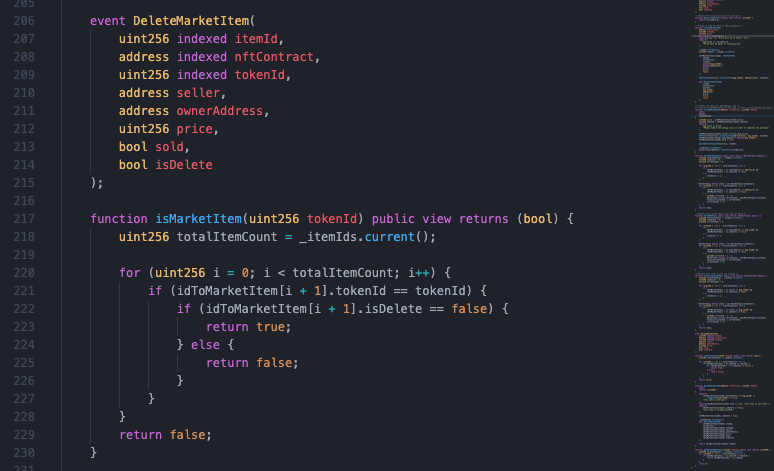

event DeleteMarketItem ใช้เก็บรายละอียดของการ delete item ที่อยู่บน market

function isMarketItem ใช้ตรวจสอบว่า NFT นั้นถูก list อยู่บน market หรือไม่

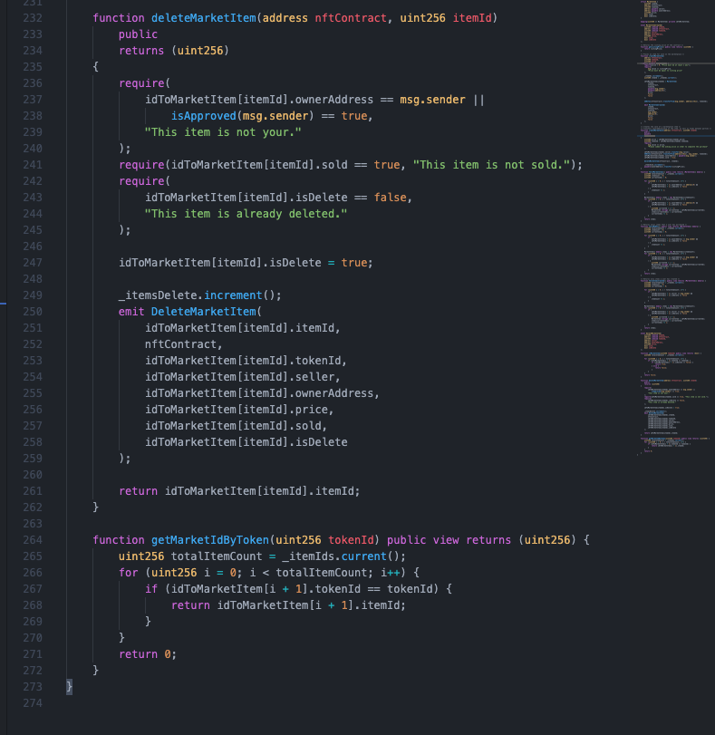

function deleteMarketItem ใช้ลบ item ที่อยู่บน market ออกไป โดยผู้ที่จะลบนั้น จะต้องเป็นเจ้าของหรือว่า address ที่ถูก approve แล้วเท่านั้น

function getMarketIdByToken ใช้ query หา id ของ item id โดย id ของ NFT

## NFTFusion.sol


contract NFTFusion ใช้สำหรับ fusion NFT เข้าด้วยกัน (burn 2 token แล้วทำการ mint ใหม่ให้กับ address เป็นผู้สร้าง transaction )
contract NFTfusion จะต้องเรียกใช้ contract NFT และ NFTMarket โดนใน constructor function นั้น เราจะรับตัวแปล 2 ตัวที่เป็น type ของ contract นั้นๆแล้วกำหนดค่าให้กับ local state เพื่อให้เราสามารถเรียกใช้ function ของ contract นั้นได้เลยผ่านตัวแปล

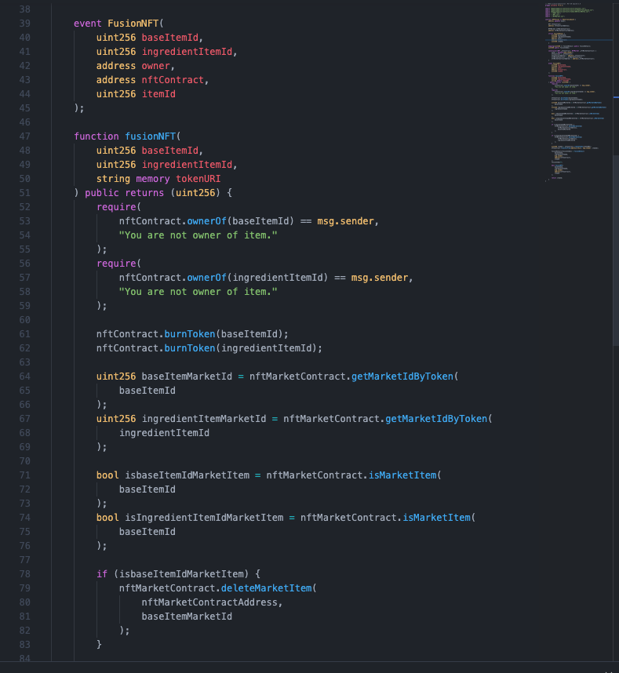

funcion fusionNFT ทำหน้าที่ fusion NFT 2 token เข้าด้วยกัน โดยจุดสำคัญของ function นี้คือการที่เราได้ทำการเรียกใช้ function ของ contract อื่นได้โดยผ่านตัวแปล nftContract, nftMarketContract ที่เราได้ทำการกำหนดค่าใน constructor ของ contract นี้ เช่น
ใน require เราได้ทำการเรียกใช้ function ownerOf ซึ้งเป็น function ที่อยุ่ใน contract NFT ผ่านตัวแปล nftContract ได้เลย

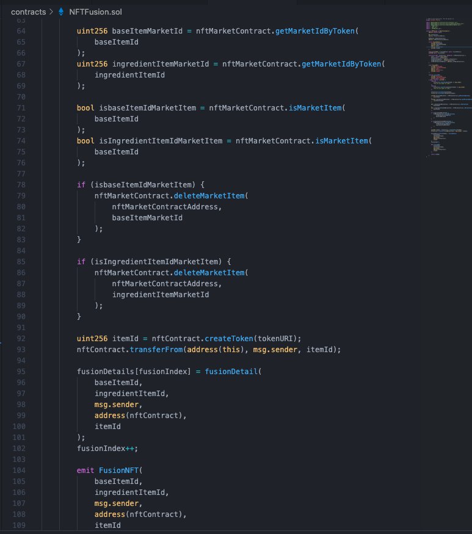

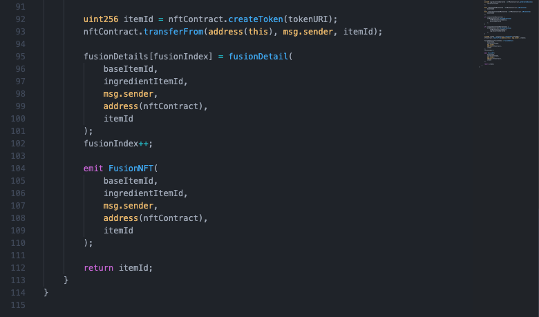

## Flow chart fusionNFT token

ภาพประกอบ flow การทำงานของ function

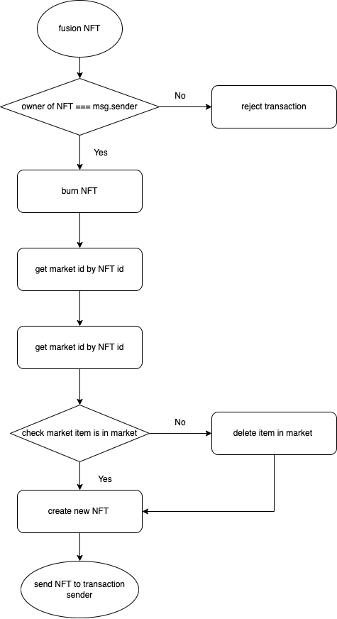

## Owner.sol

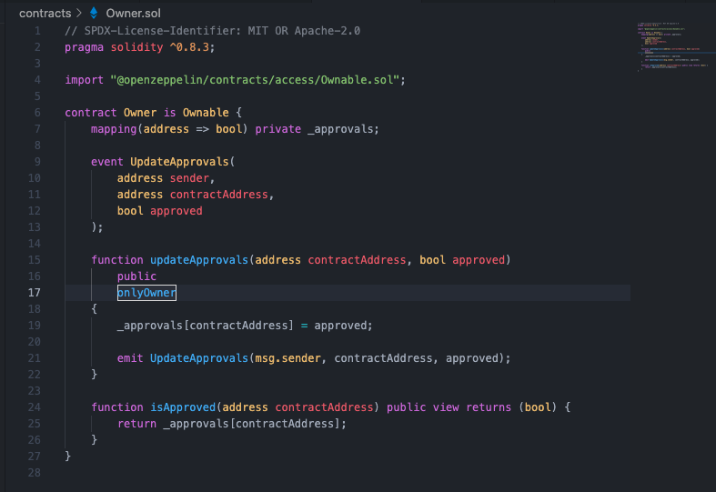

contract Owner เป็น contract ที่เกี่ยวกับการจัดเก็บ permission และความเป็นเจ้าของเพราะบาง function ที่เราต้องเรียกผ่าน contract หนึ่งไปยังอีก contract นั้นตัวแปร msg.sender จะไม่ใช้ address ของเรา แต่เป็น address ของ contract นั้นที่เป็นตัวกลางในการเรียกใช้งานเราจึงต้องเพื่ม permission ให้กับตัวกลางเพื่อให้สามารถเรียกใช้งาน function นั้นได้

mapping \_approvals เป็น mapping ที่ map ค่า address ที่เราทำการ approved กับค่า bool เพื่อให้รู้ว่า address ไหนบ้างที่มีสิทธฺในการเรียกใช้งาน contract นั้นๆได้บ้าง

function updateApprovals เนื่องจาก ตัวแปล \_approvals ถูกกำหนดค่าให้เป็น private ไม่สามารถเข้าถึงได้นอก contract เราจึงต้องสร้าง function ที่สามารถเรียกใช้งานได้นอก contract ขึ้นมาเพื่อ update ตัวแปร \_approvals ได้และจะเรียกใช้งานได้เฉพาะ owner ของ contract นั้นๆด้วย ( address ที่เป็นผู้ deploy contract )

function isApproved ใช้ตรวจสอบ ว่า address ที่ส่งมานั้นได้รับ permission ในการใช้งาน function หรือไม่
