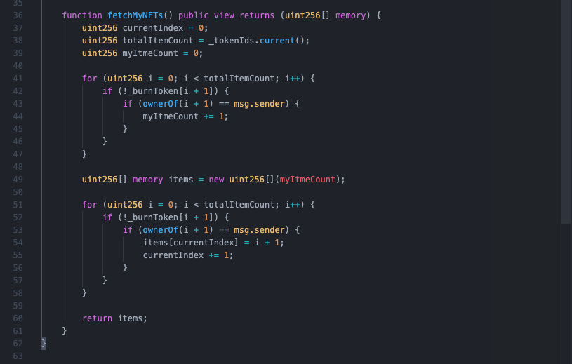

# NFT Marketplace Fusion Token with NodeJs

## Function เเละ เป้าหมายของ  Project

- สร้างตลาดสำหรับซื้อขาย NFT
- สามารถสร้าง NFT ขึ้นมาได้
- อัพโหลดข้อมูลของ NFT ไปที่ IPFS ( protocol and peer-to-peer network for storing data ) เเละ ข้อมูลบน blockchain
- fusion token ระหว่างสอง token

## Init Project

```
npm install -g truffle
```

เมื่อลงเสร็จเเล้วสามารถเช็ดได้ว่าเราได้ทำการ install สำเร็จหรือไม่ ผ่านคำสั่ง

```
truffle -v
```


หากทำการ install สำเร็จผลลัพท์จะออกจามรูป

หลังจากนั้นสร้าง folder ปล่าวขึ้นมาสำหรับทำโปรเจค

```
mkdir nft-marketplace-server-doc
```

จากนั้นเข้าไปที่ folder ที่สร้างขึ้นมา

```
cd nft-marketplace-server-doc
```

เเล้วทำการ init project ขึ้นมาผ่าน npm

```
npm init -y
```


สร้าง folder src เพื่อเก็บไฟล์ต่างๆของ Project

```
mkdir src

cd src

mkdir page & mkdir js
```

จากนั้นจะได้โครงสร้าง floder ตามรูปภาพ


หลังจากสร้างเสร็จเเล้วให้กลับไปที่ root ของ project

```
cd ..

truffle init
```


หลังจาก run คำสั่งเเล้วตัว truffle จะทำการสร้าง folder ให้ 3 folder

- folder contracts ใช้สำหรับเขียนไฟล์ solidity

- folder migrations ใช้สำหรับเขียน script เพื่อ deploy ขึ้น blockchain

- folder test ใช้สำหรับเขียน test สำหรับ smart contract

\*\*\*สำคัญมาก ตัว smart contract deploy ไปเเล้วไม่สามารถเเก้ไข้ได้ ทำได้เเค่การ deploy contract อันใหม่ขึ้นไปเเทนเท่านั้น

## Install Dependencies ที่ต้องใช้ใน Project

```
npm install @openzeppelin/contracts chai chai-as-promised express
```

- @openzeppelin/contracts ใช้สำหรับคุณสมบัติของ class ที่เขียนตามมาตรฐาน ERC20 เเละ ERC721 ที่ทาง openzeppelin ได้เขียนไว้มาใช้
- chai เเละ chai-as-promised ใช้สำหรับเขียน test ของ smart contract
- express ใช้สำหรับสร้าง server

## สร้าง File Smart Contract (.sol)

สร้าง file smart contract (.sol) 5 ไฟล์ ใน folder contract

NFT.sol ใช้สำหรับ เขียน contract สำหรับ NFT

NFTMarket.sol ใช้สำหรับ เขียน contract สำหรับ ซื้อขาย nft ที่ถูกสร้างขึ้น

NFTFusion.sol ใช้สำหรับเป็นตัวกลางในการจัดการ NFT และ marketplace ในการ fusion ระหว่างสอง token

INFT.sol เป็น infterface สำหรับเรียกใช้งานคำสั่งจากอีก contract ผ่าน interface

Owner.sol เป็น contract สำหรับบอกว่าใครเป็นเจ้าของ contract และใครบ้านที่สามารถเรียกใช้งาน function ของ owner หรือว่า approvals ได้

## Flow Chart การทำงานของ Application

แต่ละสีแทนการเรียกใช้งาน contract ในแต่ละครั้ง ซึ้งการที่เรานั้นใช้งานได้หลาย contract ในการ call function หนึ่งครั้ง เป็นเพราะเราสามารถเรียกใช้งาน function ของอีก contract ได้ภายใน contract หลักที่เราได้ทำการเรียกใช้าน


## NFT.sol


Counter เป็น object ที่ใช้ในการเพิ่มลบจำนวนของ id มี function ย่อย 3 function ได้เเก้ increment() current() decrement() ซึ้งเราจะนำมาใช้เป็น type ของ ตัวแปล \_tokenIds เพื่อใช้ track id ของ token

\_burnToken เป็น mapping ที่เก็บค่า uint256 กับ bool เพื่อใช้ track ว่า token ไหนที่เราได้ทำการ burn ไปแล้ว

โดย constructor ของ contract นี้จะรับ address ของ marketplaceAddress เป็น parameter ซึ้งเราจะใช้ address นี้ในการใช้งาน setApprovalForAll เพื่อให้ contract marketplace สามารถเรียกใช้งาน function ของ contract NFT ที่จำเป็นต้องอยู่ในรายการที่ผ่านการ approve แล้วเท่านั้น

function createToken สำหรับการสร้าง token ขึ้นมาใหม่โดยใช้ \_tokenIds ที่เราสร้างไว้มาเป็น tokenId ตัวใหม่ โดย map กับ tokenURI ที่เราได้ทำการส่งมาด้วย

function burn token เป็นการลบ token ออกจาก mapping ที่ contract ได้ทำการเก็บไว้ ทำให้เราไม่สามารถเข้าถึง owner และ tokenURI ที่เราได้ทำการเก็บไว้ใน mapping ได้อีก

function fetchMyNFTs ทำหน้าที่ในการ filter token ที่เราได้เป็นเข้าของ และ ไม่ได้ทำการ burn ไปแล้วออกมาใรูปแบบของ array (เหตุผลที่เราจำเป็นต้องใช้ตัวแปล totalItemCount ในการ loop เพราะว่าในภาษา solidity นั้น array ไม่มี property length เพื่อหาขนาดของ array ที่เราต้องการจะสร้างและกำหนดค่าให้ array นั้น )



บรรทัดที่ 1 license ถ้าไม่ใส่ file truffle จะไม่สามารถ compile ได้

บรรทัดที่ 4 counter เป็น object ที่ใช้ในการเพิ่มลบจำนวนของ id มี function ย่อย 3 function ได้เเก้ increment() current() decrement()

บรรทัดที่ 5 เเละ 6 เป็น class ที่ทาง openzeppelin เขียนขึ้นมาตาม เขียนตามมาตรฐาน ERC20 เเละ ERC721 ทำให้เรา import function เเละ property มาใช้ได้เลย

บรรทัดที่ 9-10 เป็นการนำ object Counters มาใช้งาน เเละ ประกาศให้ \_tokenIds เป็นตัวเเปล private ประเภท Counters
บรรทัดที่ 11 สร้าง contractAddress เป็นตัวเเปลเป็นประเภท address (เช่น address ของ กระเป๋า metamask)

บรรทัดที่ 13 เป็นการประกาศ function พิเศษ (constructor) ที่ run ครั้งเดี่ยวเมื่อ deploy contract เท่านั้น ใน function นี้ จะมี parameter ทั้งหมด 3 ตัวได้เเก่
marketplaceAddress ที่ใช้สำหรับกำหนดค่าของตัวเเปล contractAddress \_name เเละ \_symbol เพื่อใช้ในการบอกชื่อเเละตัวย่อยของ NFT

บรรทัดที่ 17 function createToken ใช้สำหรับสร้าง token เริ่มจาก
\_tokenIds.increment() เพื่อเพิ่มค่าของตัวเเปล \_tokenIds ไม่ให้ซ้ำกับตัวเเปลตัวก่อนหน้า
เเละทำการ mint NFT ผ่าน function \_mint(msg.sender, newItemId) เเละทำการโอน NFT ไปให้กับ address ที่เรียกใช้ function นี้ ( \_mint() เป็น function ที่สืบทอดมาจาก class ERC721 )
\_setTokenURI(newItemId, tokenURI) เป็น function ที่ใช้ในการเพิ่ม mapping เข้าไปใน array เพื่อเก็บข้อมูลของ NFT นั้นๆ
setApprovalForAll(contractAddress, true) เป็น function ที่ใช้ในการ approve ว่าเจ้าของ NFT นั้นๆ อนุญาติให้ NFT สามารถถูกโอนให้ผู้อื่นได้
ถ้าไม่ทำการ approve จะไม่สามารถทำการโอน NFT ให้ผู้ address ได้


## NFTMarket.sol


บรรทัดที่ 8 สร้าง contract NFTMarket ขึ้นมา โดยการสือทอด Class ReentrancyGuard

บรรทัดที่ 10 - 11 สร้างตัวเเปล \_itemIds เเละ \_itemsSold เป็นชนิด private ประเภท Counter

- ตัวเเปล \_itemsSold ใช้เพื่อ track จำนวน NFT ที่ถูกขายไปเเล้ว เเละ ใช้ในการกำหนดความยาวของ array ก่อนที่จะส่งออกไปเมื่อเรียกใช้ function fetchMarketItems()

บรรทัดที่ 13 สร้างตัวแปล owner เป็นชนิด payable ประเภท address เพื่อกำหนดผู้เป็นเจ้าของ contract

บรรทัดที่ 14 สร้าง listingPrice ประเภท uint256 เพื่อใช้เป็นค่าธรรมเนียมในการ list ขึ้นบนตลาด

บรรทัดที่ 16 กำหนดค่าของตัวแปล owner ( msg.sender มีค่าเท่ากับ address ของผู้ deploy contract นี้ )

บรรทัดที่ 20 สร้าง struct ของ MarketItem เพื่อเก็บข้อมูลของ item นั้นๆ ( struct คือโครงสร้างข้อมูลที่เราต้องการที่จะเก็บโดยเราสามารถออกแบบเองได้ ปล. คล้ายๆ Object )

บรรทัดที่ 30 สร้างตัวแปล idToMarketItem ชนิด private ประเภท mapping ระหว่าง id ของ market และ MarketItem

บรรทัดที่ 32 สร้าง event ชื่อ MarketItemCreated จะ emit event เมื่อ ทำการสร้าง MarketItem เสร็จแล้ว (event จะ return ออกมาเมื่อทำการเรียก function ผ่านหน้าบ้าน)


บรรทัดที่ 43 สร้าง function getListingPrice เพื่อ return ค่าของตัวแปล listingPrice

บรรทัดที่ 48 createMarketItem เป็น function สำหรับการนำ NFT ที่ถูกสร้างขึ้นมาเเล้วนำมาขายบน marketplace

บรรทัดที่ 53 จะทำการเช็คกับ ตัวแปล price ทีส่งเข้ามา ว่าต้องมีต่ามากกว่า 0 wei

บรรทัดที่ 54 จะเช็คกับ transaction ว่า value ที่ส่งเข้ามานั้นมีค่าเท่ากับ listingPrice ที่ถูกกำหนดไว้หรือไม่ ( msg เป็นตัวแปลพิเศษที่ถูกส่งมาพร้อมกับ transaction เมื่อเกิดการทำธุรกรรม )

บรรทัดที่ 56 เเละ 57 เพิ่มค่าของตัวแปล \_itemIds แล้วนำค่าตัวแปลไปกำหนด itemId

บรรทัดที่ 59 สร้าง MarketItem จากนั้นนำไปเก็บไว้ใน idToMarketItem โดย mapping กับ itemId

บรรทัดที่ 69 โอนความเป็นเจ้าของ NFT จากผู้ส่ง transaction ไปที่ contract เพื่อให้ contract สามารถส่งต่อไปที่ผู้ซื้อได้ เมื่อมีผู้มาซื้อจาก marketplace

บรรทัดที่ 71 emit event MarketItemCreted


บรรทัดที่ 84 createMarketSale เป็น function จะถูกใช้เมื่อมีการซื้อเกืดขึ้นบน marketplace

บรรทัดที่ 88 และ 89 เป็นการดึงค่าของราคา และ tokenId นั้นๆ ออกมาใช้งานผ่าน mapping ของ idTomarketItem

บรรทัดที่ 90 เป็นการเช็คว่า จำนวนเงินที่ส่งมานั้นมีค่าเท่ากับราคาของ NFT ที่ address นั้นจะทำการซื้อ

บรรทัดที่ 92 จะทำการโอนเงินจากที่ผู้ส่ง transaction ไปที่ address ของผู้ขาย

บรรทัดที่ 93 ทำการโอนความเป็นเจ้าของของ NFT นั้นไปให้ผู้ซื้อ

บรรทัดที่ 94 กำหนดค่าของ owner ใน mapping idToMarketItem ที่ id นั้น ให้เท่ากับ address ผู้ส่ง transaction นั้น ( ผู้ซื้อ ) และ sold ให้เป็น true

บรรทัดที่ 96 บวกค่าของตัวแปล itemsSold ไป 1

บรรทัดที่ 97 โอนเงินค่า listingPrice ไปที่เจ้าของ Contract ( address ที่ deployed Contract )

บรรทัดที่ 101 fetchMarketItems เป็น function สำหรับ เรียกรายการ NFT ทั้งหมดที่ยังไม่ได้ขายเเต่ list อยู่บน marketplace

บรรทัดที่ 102 เป็นการดึงจำนวน id ล่าสุดที่ถูกสร้างขึ้นจะได้จำนวนของ item ที่ถูกสร้างขึ้นมาทั้งหมดบน marketplace

บรรทัดที่ 103 เป็นการหาจำนวนของ NFT ที่ list อยุ่บน marketplace แต่ยังไม่ถูกซื้อ โดยการ นำจำนวนทั้งหมดของ item มาลบกับจำนวน item ที่ถูกทำการขายไปแล้ว

บรรทัดที่ 104 สร้างตัวแปลที่ใช้ในการ loop

บรรทัดที่ 106 สร้างตัวแปลชนิด memory ประเภท array ที่ชื่อว่า items ขึ้นมาโดยกำหนดให้มีความยาวของ array เท่ากับจำนวนของ item ที่อยู่บน marketplace ที่ยังไม่ได้ขาย

บรรทัดที่ 107 loop ไปที่ mapping ของ idToMarketItem ตามความยาวของตัวแปลที่ได้มากจาก itemCount เนื่องจาก mapping ไม่สามารถ loop ได้จึงได้เอาความยาวของ mapping มาใช้เเทนโดยเลือกจาก item ที่มีค่าของ owner เท่ากับ address(0) ( address(0) มีค่าเท่ากับ 0x00... ซื้อเราได้กำหนดค่าให้ตอนที่สร้างขึ้นมา ) หลังจากนั้นจึงนำค่าที่ได้ไปใส่ใน array ที่เราสร้างขึ้นจนครบจำนวน loop ที่เราต้องการจึง return ออกไป


บรรทัดที่ 119 fetchMyNFTs เป็น function สำหรับ เรียกรายการ NFT ทั้งหมดที่ address ที่สร้าง transaction ขึ้นเป็นเจ้าของ

บรรทัดที่ 124 loop ตามจำนวนความยาวของ item ที่มีทั้งหมดเพื่อหาจำนวนของ item ที่มี address ที่สร้าง transaction ขึ้นเป็นเจ้าของ

บรรทัดที่ 130 สร้าง ตัวแปล items เป็น array และมีความยาวเท่ากับจำนวนจำนวน NFT ที่ address นั้นเป็นเจ้าของ

บรรทัดที่ 131 loop ตามจำนวนความยาวของ mapping idToMarketItem โดยเลือกจาก item ที่มีค่าของ owner เท่ากับ msg.sender ( address ที่เป็นผู้ส่ง transaction ) เเล้ว return กลับไป


บรรทัดที่ 143 fetchItemsCreated เป็น function สำหรับ เรียกรายการ NFT ทั้งหมดที่ address ที่สร้าง transaction ขึ้นเป็นคนสร้างขึ้น

บรรทัดที่ 146 loop ตามจำนวนความยาวของ item ที่มีทั้งหมดเพื่อหาจำนวนของ item ที่มี address ที่สร้าง transaction ขึ้นเป็นคนสร้างขึ้นมา

บรรทัดที่ 154 สร้าง ตัวแปล items เป็น array และมีความยาวเท่ากับจำนวนจำนวน NFT ที่ address ที่สร้าง transaction ขึ้นเป็นคนสร้างขึ้นมา

บรรทัดที่ 156 loop ตามจำนวนความยาวของ mapping idToMarketItem โดยเลือกจาก item ที่มีค่าของ seller เท่ากับ msg.sender ( address ที่เป็นผู้ส่ง transaction ) เเล้ว return กลับไป
