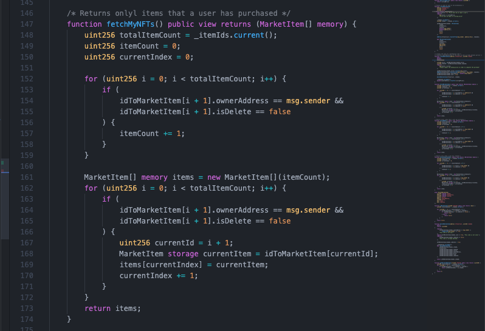

# NFT Marketplace Fusion Token with NodeJs

## Function เเละ เป้าหมายของ  Project

- สร้างตลาดสำหรับซื้อขาย NFT
- สามารถสร้าง NFT ขึ้นมาได้
- อัพโหลดข้อมูลของ NFT ไปที่ IPFS ( protocol and peer-to-peer network for storing data ) เเละ ข้อมูลบน blockchain
- fusion token ระหว่างสอง token

## Init Project

```
npm install -g truffle
```

เมื่อลงเสร็จเเล้วสามารถเช็ดได้ว่าเราได้ทำการ install สำเร็จหรือไม่ ผ่านคำสั่ง

```
truffle -v
```


หากทำการ install สำเร็จผลลัพท์จะออกจามรูป

หลังจากนั้นสร้าง folder ปล่าวขึ้นมาสำหรับทำโปรเจค

```
mkdir nft-marketplace-server-doc
```

จากนั้นเข้าไปที่ folder ที่สร้างขึ้นมา

```
cd nft-marketplace-server-doc
```

เเล้วทำการ init project ขึ้นมาผ่าน npm

```
npm init -y
```


สร้าง folder src เพื่อเก็บไฟล์ต่างๆของ Project

```
mkdir src

cd src

mkdir page & mkdir js
```

จากนั้นจะได้โครงสร้าง floder ตามรูปภาพ


หลังจากสร้างเสร็จเเล้วให้กลับไปที่ root ของ project

```
cd ..

truffle init
```


หลังจาก run คำสั่งเเล้วตัว truffle จะทำการสร้าง folder ให้ 3 folder

- folder contracts ใช้สำหรับเขียนไฟล์ solidity

- folder migrations ใช้สำหรับเขียน script เพื่อ deploy ขึ้น blockchain

- folder test ใช้สำหรับเขียน test สำหรับ smart contract

\*\*\*สำคัญมาก ตัว smart contract deploy ไปเเล้วไม่สามารถเเก้ไข้ได้ ทำได้เเค่การ deploy contract อันใหม่ขึ้นไปเเทนเท่านั้น

## Install Dependencies ที่ต้องใช้ใน Project

```
npm install @openzeppelin/contracts chai chai-as-promised express
```

- @openzeppelin/contracts ใช้สำหรับคุณสมบัติของ class ที่เขียนตามมาตรฐาน ERC20 เเละ ERC721 ที่ทาง openzeppelin ได้เขียนไว้มาใช้
- chai เเละ chai-as-promised ใช้สำหรับเขียน test ของ smart contract
- express ใช้สำหรับสร้าง server

## สร้าง File Smart Contract (.sol)

สร้าง file smart contract (.sol) 5 ไฟล์ ใน folder contract

NFT.sol ใช้สำหรับ เขียน contract สำหรับ NFT

NFTMarket.sol ใช้สำหรับ เขียน contract สำหรับ ซื้อขาย nft ที่ถูกสร้างขึ้น

NFTFusion.sol ใช้สำหรับเป็นตัวกลางในการจัดการ NFT และ marketplace ในการ fusion ระหว่างสอง token

INFT.sol เป็น infterface สำหรับเรียกใช้งานคำสั่งจากอีก contract ผ่าน interface

Owner.sol เป็น contract สำหรับบอกว่าใครเป็นเจ้าของ contract และใครบ้านที่สามารถเรียกใช้งาน function ของ owner หรือว่า approvals ได้

## Flow Chart การทำงานของ Application

แต่ละสีแทนการเรียกใช้งาน contract ในแต่ละครั้ง ซึ้งการที่เรานั้นใช้งานได้หลาย contract ในการ call function หนึ่งครั้ง เป็นเพราะเราสามารถเรียกใช้งาน function ของอีก contract ได้ภายใน contract หลักที่เราได้ทำการเรียกใช้าน


## NFT.sol


Counter เป็น object ที่ใช้ในการเพิ่มลบจำนวนของ id มี function ย่อย 3 function ได้เเก้ increment() current() decrement() ซึ้งเราจะนำมาใช้เป็น type ของ ตัวแปล \_tokenIds เพื่อใช้ track id ของ token

\_burnToken เป็น mapping ที่เก็บค่า uint256 กับ bool เพื่อใช้ track ว่า token ไหนที่เราได้ทำการ burn ไปแล้ว

โดย constructor ของ contract นี้จะรับ address ของ marketplaceAddress เป็น parameter ซึ้งเราจะใช้ address นี้ในการใช้งาน setApprovalForAll เพื่อให้ contract marketplace สามารถเรียกใช้งาน function ของ contract NFT ที่จำเป็นต้องอยู่ในรายการที่ผ่านการ approve แล้วเท่านั้น

function createToken สำหรับการสร้าง token ขึ้นมาใหม่โดยใช้ \_tokenIds ที่เราสร้างไว้มาเป็น tokenId ตัวใหม่ โดย map กับ tokenURI ที่เราได้ทำการส่งมาด้วย

function burn token เป็นการลบ token ออกจาก mapping ที่ contract ได้ทำการเก็บไว้ ทำให้เราไม่สามารถเข้าถึง owner และ tokenURI ที่เราได้ทำการเก็บไว้ใน mapping ได้อีก


function fetchMyNFTs ทำหน้าที่ในการ filter token ที่เราได้เป็นเข้าของ และ ไม่ได้ทำการ burn ไปแล้วออกมาใรูปแบบของ array (เหตุผลที่เราจำเป็นต้องใช้ตัวแปล totalItemCount ในการ loop เพราะว่าในภาษา solidity นั้น array ไม่มี property length เพื่อหาขนาดของ array ที่เราต้องการจะสร้างและกำหนดค่าให้ array นั้น )


## NFTMarket.sol


NFTMarket เป็น contract ที่ใช้สำหรับเป็นตัวแทนสำหรับซื้อขาย NFT ที่เราได้ทำการ mint ขึ้นมา

ใน function constructor นั้นเราจะกำหนดให้ผู้ที่สร้าง transaction เป็นเจ้าของของ contract นี้ทำให้ address นั้นสามารถเรียกใช้ function ที่จำกัดให้เฉพาะ owner ได้

struck MarketItem จะเป็น type ที่เราสามารถกำหนดขึ้นเองได้ว่าภายในได้ว่าเราต้องการจะให้มีอะไรบ้างภายใน struct (คล้ายๆ Object)

event MarketItemCreated ให้เราลองนึกภาพคล้ายการเก็บข้อมูลแบบ log แบบปกติที่เราสามารถดักจับ event เมื่อเกิดขึ้นได้ และสามารถ query ขึ้นมาดูได้ส่วน key words indexed นั้นเราใส่เพื่อให้สามารถ query โดยใช้ค่าของตัวแปลนั้นในการ query ได้ โดยเราจะทำการ emit event นี้ทุกครั้งที่มีการ สร้าง market item ขึ้นมาใหม่

idToMarketItem เป็น maping ของ uint256 กับ MarketItem ที่ใช้ map id ของ item เข้ากับข้อมูลของ item นั้นๆ

function getListingPrice ทำหน้าที่ return ค่าธรรมเนียมที่ user ต้องจ่ายทุกครั้งที่ได้ทำการขายสินค้าบน market


function createMarketItem ใช้สำหรับสร้าง market item ขึ้นมาใหม่โดนการโอนความเป็นเจ้าของของ nft นั้นๆไปที่ contract เพื่อให้ contract market สามารถ list บน market ได้โดย id ของ item นั้นมากจาก \_itemIds และจะถูกเพิ่มค่าขึ้นที่ละ 1 ก่อนการสร้าง item ขึ้นมาในทุกๆครั้ง


function createMarketSale เป็น function ที่ใช้ซื้อ item ที่อยู่ใน market โดยการโอนเงินตามจำนวนมี่ตั้งให้กับผู้ตั้งขาย แล้วทำการโอนความเป็นเจ้าของของ NFT นั้นให้กับผู้ซื้อ หลังจากนั้นลบ item ที่อยู่บน market



function fetchMyNFTs ทำหน้าที่ return item ที่เราเป็นเจ้าของกลับออกมาในรูปแบบ array เหตุผลที่เราใช้ key words memory เพราะว่าถ้าเราไม่ใช้ node ของ block เวลาที่เขียนกลับส่งมาหาเราจะเขียนบน storage ทำให้ใช้ค่า gas มากว่า การเขียนบน memory และการที่เรากำหนดความยาวของ array ให้กับตัวแปล items จะทำให้ค่า gas ถูกลงกว่าการที่เราไม่กำหนดความยากให้กับ array ในตอนแรก


function fetchItemsCreated จะทำหน้าที่เหมือนกับ function fetchMyNFTs แต่จะเปลี่ยนเงื่อนไขเป็น item ที่เราเป็นคนสร้างแทน


event DeleteMarketItem ใช้เก็บรายละอียดของการ delete item ที่อยู่บน market

function isMarketItem ใช้ตรวจสอบว่า NFT นั้นถูก list อยู่บน market หรือไม่


function deleteMarketItem ใช้ลบ item ที่อยู่บน market ออกไป โดยผู้ที่จะลบนั้น จะต้องเป็นเจ้าของหรือว่า address ที่ถูก approve แล้วเท่านั้น

function getMarketIdByToken ใช้ query หา id ของ item id โดย id ของ NFT

## NFTFusion.sol


contract NFTFusion ใช้สำหรับ fusion NFT เข้าด้วยกัน (burn 2 token แล้วทำการ mint ใหม่ให้กับ address เป็นผู้สร้าง transaction )
contract NFTfusion จะต้องเรียกใช้ contract NFT และ NFTMarket โดนใน constructor function นั้น เราจะรับตัวแปล 2 ตัวที่เป็น type ของ contract นั้นๆแล้วกำหนดค่าให้กับ local state เพื่อให้เราสามารถเรียกใช้ function ของ contract นั้นได้เลยผ่านตัวแปล


funcion fusionNFT ทำหน้าที่ fusion NFT 2 token เข้าด้วยกัน โดยจุดสำคัญของ function นี้คือการที่เราได้ทำการเรียกใช้ function ของ contract อื่นได้โดยผ่านตัวแปล nftContract, nftMarketContract ที่เราได้ทำการกำหนดค่าใน constructor ของ contract นี้ เช่น
ใน require เราได้ทำการเรียกใช้ function ownerOf ซึ้งเป็น function ที่อยุ่ใน contract NFT ผ่านตัวแปล nftContract ได้เลย


## Flow chart fusionNFT token

ภาพประกอบ flow การทำงานของ function


## Owner.sol


contract Owner เป็น contract ที่เกี่ยวกับการจัดเก็บ permission และความเป็นเจ้าของเพราะบาง function ที่เราต้องเรียกผ่าน contract หนึ่งไปยังอีก contract นั้นตัวแปร msg.sender จะไม่ใช้ address ของเรา แต่เป็น address ของ contract นั้นที่เป็นตัวกลางในการเรียกใช้งานเราจึงต้องเพื่ม permission ให้กับตัวกลางเพื่อให้สามารถเรียกใช้งาน function นั้นได้

mapping \_approvals เป็น mapping ที่ map ค่า address ที่เราทำการ approved กับค่า bool เพื่อให้รู้ว่า address ไหนบ้างที่มีสิทธฺในการเรียกใช้งาน contract นั้นๆได้บ้าง

function updateApprovals เนื่องจาก ตัวแปล \_approvals ถูกกำหนดค่าให้เป็น private ไม่สามารถเข้าถึงได้นอก contract เราจึงต้องสร้าง function ที่สามารถเรียกใช้งานได้นอก contract ขึ้นมาเพื่อ update ตัวแปร \_approvals ได้และจะเรียกใช้งานได้เฉพาะ owner ของ contract นั้นๆด้วย ( address ที่เป็นผู้ deploy contract )

function isApproved ใช้ตรวจสอบ ว่า address ที่ส่งมานั้นได้รับ permission ในการใช้งาน function หรือไม่

## Testing


การ Test contract ใน truffle นั้นเราจะใช้ mocha และ chai เป็นตัวช่วยในการเขียน test โดยเราจะต้องทำการ import contract เข้ามาก่อนผ่านตัวแปล artifacts ที่ truffle มีให้เรา

ใช้ function contract แทน describe ในการเขียนเทสของ mocha นั้น ปกติเราจะใช้ describe เป็น function ที่ใช้ test แต่ในการเขียน test ของ truffle นั้นเราจะใช้ function contract แทน truffle จะทำการ re-deploy contract ทุกครั้งทำให้ไม่มี state ที่เราได้ทำการ run test ก่อนหน้าเหลืออยู่

function contract รับ parameter สองตัวได้เเก่ string และ callback function

- string ใช้เพื่อบอกว่าเราอยู่ใน state ไหนของการ test
- callback function จะเป็น function ที่เราจะทำการเขียน test ภายในรับ parameter เป็น array ของ address ที่เราต้องการ index ที่ 0 ของ array จะเป็น address ที่เรา deploy เสมอโดยตำแหน่งอื่นๆ จะเป็น address อื่นๆที่ truffle ได้เตียมไว้ให้เรา

```
contract("NFTMarket", ([deployer, author, tipper]) => {})
```

function before เป็น function ที่จะ ทำงานเป็นอันดับแรกก่อน function อื่นๆที่เรา test ซึ้งเราจะ deploy contract ใน function นี้เราจะ deploy contract โดยการเรียกใช้ function ที่อยู่ในตัวแปลที่เรา import มาผ่าน artifacts และเรียกใช้ function deployed โดย parameter จะขึ้นอยู่กับ constructor ของ contract นั้นๆ

```
  before(async () => {
    ...
    ...
    fusion = await NFTFusion.deployed(nft.address, market.address);
    ...
  });
```

function describe รับ parameter สองค่าคือ string เพื่อบอก state ของการ test และ callback function ที่เราจะทำการเขียน test เหมือนกันกับ function it ที่ทำงานเหมือนกัน แต่จะเป็น state ย่อยลงมาก

```

  describe("deployment",async () => {

    ...

    it("deploys NFTMarket successfully", async () => {
      NFTMarketAddress = await market.address;
      assert.notEqual(NFTMarketAddress, 0x0);
      assert.notEqual(NFTMarketAddress, "");
      assert.notEqual(NFTMarketAddress, null);
      assert.notEqual(NFTMarketAddress, undefined);
    });

    ...
  }

```

การเทียบค่า โดยในการเปรียนเทีบค่าในการเทียบค่าเราจะใช้ assert ที่อยุ่ใน chai มาช่วยในการ test assert เป็น object ที่ภายในมี function ในการเทียบค่า เช่น notEqual, equal เป็นต้น โดยจะมี parameter 2 ตัวที่ require เป็นค่าที่เราต้องการจะเปรียบเทียบ และ 1 เป็น optional เป็น string ที่เป็น wording ที่บอกว่าเกิดความผิดพลาดอะไรขึ้นในการเปรียบเทียบนั้น รวมเป็น 3 ตัว

```
assert.notEqual(marketId1, 0, "this item is not in market. - first token ")

```

การเรียกใช้ function ของ smart contract ในไฟล์ test นั้นแตกต่างกับการเรียกใช้ฝั่งหน้าบ้านอยู่แต่ไม่มาก การเรียกใช้งานนั้นสามารถเข้าถึง function ได้ผ่าน instance ที่เราได้ทำการ deploy ไปแล้วนั้นเอง

```
await nft.createToken("https://www.mytokenlocation.com");
```

การเลือก address ที่จะทำ transaction และ การโอนเงินผ่าน smart contract ใน test สามารถทำได้เลยผ่าน function โดยการเพิ่ม parameter ที่เป็นประเภท object เข้าไป การโอนเงินสามารถส่งได้ผ่าน function ที่เป็น payable (ถ้าเราส่ง transaction ที่ส่งจำนวนเงินไปที่ funciton ที่ไม่ได้เป็น payable transaction จะ reject)

```
await market.createMarketSale(NFTAddress, 1, {
        from: buyerAddress,
        value: auctionPrice,
      });
```

object ที่เพิ่มเข้าไป นั้นไม่ใช่ parameter ที่ถูกเขียนลงใน smart contract แต่เป็นการเพิ่มเข้าไปของ truffle เพื่อระบุจำนวนเงินและ address ที่เราต้องการ โดย default ถ้าเราไม่ส่งค่าอะไรเข้าไปเลย address ที่ส่งไปจะเป็น address ที่ 0 valueจะเป็น 0

การเข้าถึง address ที่ truffle มีให้นั้น สามารถทำได้อีกวิธีผ่านโดยผ่านตัวแปร web3 ซึ้ง init ไว้โดย truffle อยู่แล้วและจะ return ออกมาเป็น array index ที่ 0 จะเป็น address ปัจจุบัน ไล่ไปจนถึง index ที่ 49 ซึ้งเป็น address สุดท้ายที่ truffle มีให้เราในการเขียน test ถ้าเราไม่ส่งค่าอะไรเข้าไปเลย address ที่ส่งไปจะเป็น address ที่ 0 valueจะเป็น 0

```
accounts = await web3.eth.getAccounts();
let myAddress = accounts[0]
```

การ convert ค่าเงิน Ether เป็น wei หรือสกุลเงิน ถ้าสามารถเข้าถึงได้โดยตัวแปล web3 ภายใน object utils จะเป็น function ที่เป็นเครื่องมือในการแปลหน่วยเงินต่างๆ ในกรณนนี้เราจะแปลงเป็น wei จะใช้ function toWei โดย function จะรับ parameter 2 ตัวได้แก่ ตัวที่ 1 เป็น ค่าเงินที่เราต้องการจะแปลง ตัวที่ 2 ได้แก่ หน่วยของค่าเงินของตัวเปลที่ 1

```
web3.utils.toWei("0.3", "Ether");
```

เมื่อเราทำการเขียน test ของเราเสร็จแล้วสามารถ run ได้ผ่านคำสั่ง

```
truffle test
```

truffle จะทำการ run test ผ่าน blockchain ของ ganache และแสดงผลของการ test ผ่าน terminal


### การ Config Networks ที่เราต้องการจะ Deploy

ให้ทำการไปที่ truffle-config.js

ภายใน object network เราสามารถ init config ของ network ที่เราต้องการจะเชื่อมต่อได้ โดย key ของ object คือชื่อของ network ที่เราต้องการจะเชื่อมต่อซึ้งเราจะใช้ชื่อนนี้ในการสั่งให้ truffle deploy ไปที่ network
ใด


- host คือ ip address ที่เราต้องการจะเชื่อมต่อ
- port คือ port ที่เราต้องการจะเชื่อมต่อ
- network_id คือ network id เราต้องการจะเชื่อมต่อ network id นั้นขึ้นอยู่กับว่าเราเชื่อมต่ออยู่บน chain ไหน \* หมายถึง network id ไหนก็ได้


ในกรณีเราจะเชื่อมต่อไปที่ ganache เราจะใช้ข้อมูล network ของ ganacha ในการเชื่อมต่อ

```
    development: {
     host: "127.0.0.1",
     port: 7545,
     network_id: "*",
    },
```

### Deploy Smart Contract

เราสามารถ deploy smart contrat ของเราผ่าน command

```
truffle migrate --reset --network development
```

- migrate คือคำสั่งในการ deploy truffle จะทำการอ่านไฟล์และ deploy smart contract ที่อยู่ใน floder migrations ตามที่เราเขียนไว้
- --reset จะทำการ reset ข้อมูลที่เราได้ทำการ deploy ขึ้น blockchain ก่อนหน้านี้
- --network development เป็นคำสั่งในการระบุว่า network ไหนที่เราต้องการจะ deploy

หลักจาก compile เสร็จแล้ว compiler จะ output ออกมาสองอย่างได้เเก่

- byte code ซึ่งจะ deploy ขึ้น blockchain
- ABI truffle จะสร้าง file ขึ้นมาเก็บไว้ใน floder build > contracts ซึ้งเราจะใช้ในการเชื่อมต่อเข้ากับ blockchain ผ่านทาง application ที่เราสร้างขึ้น

### init server.js

เราสร้างไฟล์ server.js ขึ้นมาเพื่อส่ง file ต่างๆไปที่ browser ของ user เพื่อใช้ในการติดต่อกับ blockchain


### MetaMask การเชื่อมต่อกับ smart contract ฝั่งหน้าบ้าน

ในการเชื่อมต่อเข้ากับ smart contract สิ่งที่จำเป็นมีสองอย่างได้แก่ ABI และ MetaMask

ในไฟล์ initWeb3.js เราจะสร้าง function ที่ใช้ในการเชื่อมต่อเข้ากับ blockchain เช่น function ในการ get ABI จาก server ของเราหรือว่า function ที่ใช้ในการตรวจสอบว่า browser ของ user นั้นมี metamask อยู่หรือไม่

function onGetAbi จะทำหน้าที่่ส่ง get request ไปที่ server ของเราเพื่อรับไฟล์ ABI กลับมาที่หน้า browser

```
async function onGetAbi(contractName) {
  let response = await fetch(`/contracts/${contractName}.json`, {
    method: "GET",
  });
  let result = await response.json();
  return result;
}
```

function loadWeb3 เป็น function ที่ใช้ในการตรวจสอบว่า browser ที่ user ใช้อยู่นั้นมี Metamask หรือ wallet อื่นๆติดตั้งอยู่หรือไม่

```
async function loadWeb3() {
  if (window.ethereum) {
    window.web3 = new Web3(window.ethereum);
    await window.ethereum.enable();
  } else if (window.web3) {
    window.web3 = new Web3(window.web3.currentProvider);
  } else {
    window.alert("Non-Ethereum browser detected.");
  }
}

```

วิธีการสร้าง instace ที่ใช้ในการเชื่อมต่อเข้ากับ blockchain
เราจะสร้างผ่านตัวแปร web3.eth.Contract ซึ้งเป็น function ที่ใช้ในการสร้าง instance โดยจะรับ parameter สองตัวได้แก่ ABI และ network address เพื่อใช้วนการ run function โดยข้อมูลต่างๆที่จำเป็นต้องใช้ในการสร้างนั้น จะถูกเก็บอยู่ใน ABI ทั้งหมด

```
const ContractInstance = new web3.eth.Contract(ContractAbi.abi, ContractNetworkData.address);
```

instance ที่เราสร้างขึ้นมานนี้จะสร้างมารถเรียก function ที่ถูกเขียนขึ้นบน smart contact ได้ทั้งหมดที่เป็น public function

ในกรณีนี้ app ที่เราสร้างจะทำการเชื่อมต่อเข้ากับ contract ที่เราสร้าง 3 contract และจะสร้าง instance ทั้งหมด 3 ตัว

```
async function loadBlockchainData() {
  const web3 = window.web3;

  const accounts = await web3.eth.getAccounts();
  console.log(accounts);

  // NetWork ID
  // get network id form metamask that we are useing
  networkId = await web3.eth.net.getId();
  // get network data form json abi file by networkId
  const NFTMarketAbiNetworkData = NFTMarketAbi.networks[networkId];
  const NFTAbiNetworkData = NFTAbi.networks[networkId];
  const NFTFusionNetworkData = NFTFusionAbi.networks[networkId];

  // check is network is valid
  if (NFTMarketAbiNetworkData && NFTAbiNetworkData && NFTFusionNetworkData) {
    // connect to contract
    NFTMarketContract = new web3.eth.Contract(
      NFTMarketAbi.abi,
      NFTMarketAbiNetworkData.address
    );

    NFTContract = new web3.eth.Contract(NFTAbi.abi, NFTAbiNetworkData.address);

    NFTFusionContract = new web3.eth.Contract(NFTFusionAbi.abi, NFTFusionNetworkData.address)

    console.log("NFTMarketContract : ", NFTMarketContract.methods);
    console.log("NFTContract : ", NFTContract.methods);
    console.log("NFTFusion : ", NFTFusionContract.methods)
  } else {
    window.alert("Contract not deployed to detected network.");
    return
  }

  if(!NFTMarketContract || !NFTContract || !NFTFusionContract){
    window.alert("Contract not deployed to detected network.");
    return
  }

  console.log("Contract deployed to network.")

}
```

การเรียกใช้ function ของ smart contract ผ่าน instance ที่ถูกสร้างขึ้น
instance ที่เราสร้างขึ้นนั้นเป็น object ซึ้
ภายในจะเก็บ method และข้อมูลต่างๆ ของ contract นั้นๆไว้ โดยเราจะเรียกใช้ function ของ contract นั้นผ่าน object methods ตามด้วยชื่อของ function ที่เราต้องการเรียกใช้ ซึ้งอยู่ภายใน instance ที่เราสร้างขึ้น ตามด้วย mode ของ function ที่เราเรียกใช้ call หรือ send

ตัวอยากการใช้ call() read mode

```
const items = await NFTMarketContract.methods.fetchMarketItems().call()

```

ตัวอย่างการใช้ send() write modes

```
let marketNFTTransaction = await NFTMarketContract.methods.createMarketItem(NFTAddress, NFTTokenID, NFTPrice).send({from: account[0], value: listingPrice})
```
